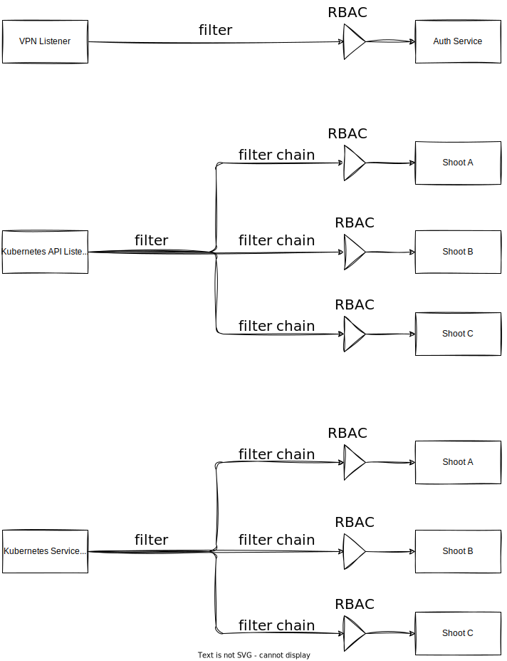

# Gardener ACL Extension

**TL;DR: The Gardener ACL extension allows you to limit the access to shoot
clusters using an allow-list mechanism. Basically, it looks like this:**

```yaml
# in the shoot object
spec:
  extensions:
  - type: acl
    providerConfig:
      rule:
        action: ALLOW
        type: remote_ip
        cidrs:
          - "1.2.3.4/24"
          - "10.250.0.0/16"
          - ...
```

The extension also supports multiple ingress namespaces, e.g. when using
Gardener `ExposureClasses` or deploying Highly Available Control Planes (see
[ADR03](./docs/adr/03_multiple_istio_namespaces.md) for more information).

Please read on for more information.

## Installation

Set your `KUBECONFIG` variable to the Garden cluster.

```sh
kubectl apply -f deploy/extension/base/controller-registration.yaml
```

## Background, Functionality & Limitations

Gardener introduced *Shoot API Server SNI* with [GEP08](https://github.com/gardener/gardener/blob/master/docs/proposals/08-shoot-apiserver-via-sni.md).

Using Istio, Gardener configures a single ingress gateway per seed to proxy
traffic to all API servers on this seed based on some criteria. At it's core,
Istio configures an envoy proxy using a set of
[Kubernetes CRDs](https://istio.io/latest/docs/reference/config/networking/).
We can hook into this mechanism and insert additional configuration, which
further limits the access to a specific cluster.

Broadly speaking, there are two different external traffic flows:

1. Kubernetes API Listener (via SNI name)
2. Apiserver-Proxy / Reversed-VPN Listener

These ways are described in more detail in the aforementioned GEP. Essentially,
these two ways are all represented by a specific Envoy listener with filters.
The extension needs to hook into each of these filters (and their filter chains)
to implement the desired behavior. Unfortunately, all types of access
require a unique way of handling them, respectively.

1. **SNI Access** - The most straightforward approach. Wen can deploy one
   additional `EnvoyFilter` per shoot with enabled ACL extension. It contains a
   filter patch that matches on the shoot SNI name and specifies an `ALLOW` rule
   with the provided IPs.
2. **Apiserver-Proxy / VPN Access** - All apiserver-proxy and VPN traffic moves through the same listener. This
   requires us to create only a single `EnvoyFilter` for VPN that contains
   **all** rules of all shoots that have the extension enabled. And, conversely,
   we need to make sure that traffic of all shoots that don't have the
   extension enabled is still able to pass through this filter unhindered. We
   achieve this by not only creating a policy for every shoot with ACL enabled,
   but also an "inverted" policy which matches all shoots that don't have ACL
   enabled. All these policies are then put in a single EnvoyFilter patch.



*Please note that the `Kubernetes Service Listener` doesn't exist anymore in current versions of Gardener.*

Because of the last point, we currently see no way of allowing the user to
define multiple rules of different action types (`ALLOW` or `DENY`). Instead, we
only support a single `ALLOW` rule per shoot, which is in our opinion the best
trade-off to efficiently secure Kubernetes API servers.

See [ADR02](./docs/adr/02_envoyfilter_patching.md) for a more in-depth
discussion of the challenges we had.

## Cloud specific settings

### Openstack

In order for the internal VPN traffic to work, the router IP adresses from the
shoot openstack projects have to get allowlisted in the ACL extension.

## Healthchecks

Gardener provides a [Health Check Library](https://gardener.cloud/docs/gardener/extensions/healthcheck-library/)
that we can use to monitor the health of resources that our extension is
responsible for. Example: If the extension controller deploys a Gardener
`ManagedResource`, we can define a health check on the extension that checks for
the health of this `ManagedResource`. This lets the extension reflect the state
of the resources it is responsible for. This is expressed by status conditions
in the extension resource itself (one per health check).

## Generating ControllerRegistration and ControllerDeployment

Extensions are installed on a Gardener cluster by deploying a
`ControllerRegistration` and a `ControllerDeployment` object to the garden
cluster. In this repository, you find an example for both of these resources in
the `deploy/extension/base/controller-registration.yaml` file. 

The `ProviderConfig.chart` field contains the entire Helm chart for your
extension as a gzipped and then base64-encoded string. After you altered this
Helm chart in the `charts/gardener-extension-acl` directory, run `make generate` to
re-create this value. 

## Tests

To run the test suite, execute:

```bash
make test
```

Place all needed Gardener CRDs in the `upstream-crds` directory, they get
installed automatically in the envtest cluster.

See the [actuator_test.go](pkg/controller/actuator_test.go) for a minimal test
case example.

## Local deployment

Set up a garden [local-setup](https://github.com/gardener/gardener/blob/master/docs/deployment/getting_started_locally.md).

To install the extension with 2 ways:

`make extension-up` this will install the acl-extension into the local gardener environment.

`make extension-dev` this will also install the acl-extension into the local gardener environment but it will rebuild and redeploy if you press any key in the terminal.


### Local debugging

This can only be done with the gardener [local-setup](https://github.com/gardener/gardener/blob/master/docs/deployment/getting_started_locally.md).

After your local gardener is ready you can start the controller

Install extension
```bash
make extension-up
```

Disable reconcile of managed resource
```bash
kubectl annotate managedresource acl-XXXXXX resources.gardener.cloud/ignore="true"
```

Scale down acl-extension:
```bash
kubectl scale deployment -n extension-acl-XXXXXXX --replicas=0 gardener-extension-acl
```

Now you can run the acl-extension locally to debug it.

```bash
make run
```